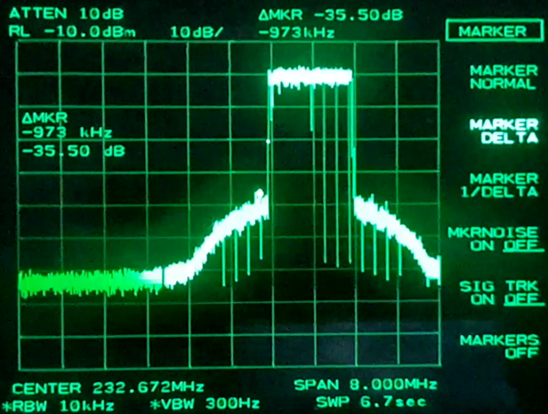
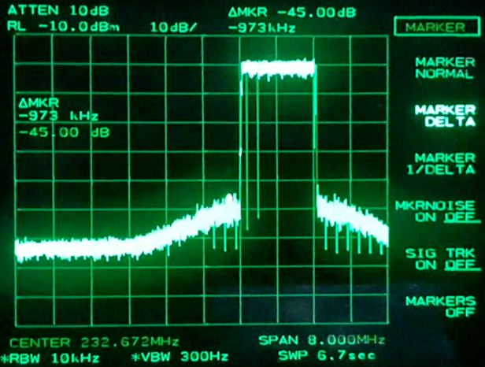

Digital Predistortion Calculation Engine for ODR-DabMod
=======================================================

This folder contains a prototype to do digital predistortion. It was tested on
the development system only.

Concept
-------

ODR-DabMod makes outgoing TX samples and feedback RX samples available for an external tool. This
external tool can request a buffer of samples for analysis, can calculate coefficients for the
predistorter in ODR-DabMod and load the new coefficients using the remote control.

The predistorter in ODR-DabMod supports two modes: polynomial and lookup table.
But at the moment only the polynomial model is implemented.

The *dpd/main.py* script is the entry point for the *DPD Calculation Engine* into which these
features will be implemented. The tool uses modules from the *dpd/src/* folder:

- Sample transfer and time alignment with subsample accuracy is done by *Measure.py*
- Estimating the effects of the PA using some model and calculation of the updated
  polynomial coefficients is done in *Model.py*
- Finally, *Adapt.py* loads them into ODR-DabMod.

These modules themselves use additional helper scripts in the *dpd/src/* folder.

Requirements
------------

- USRP B200.
- Power amplifier.
- A feedback connection from the power amplifier output, at an appropriate power level for the B200.
  Usually this is done with a directional coupler and additional attenuators.
- ODR-DabMod with enabled *dpd_port*, and with a samplerate of 8192000 samples per second.
- Synchronous=1 so that the USRP has the timestamping set properly, internal refclk and pps
  are sufficient for this example.
- A live mux source with TIST enabled.

See dpd/dpd.ini for an example.

The DPD server port can be tested with the *dpd/show_spectrum.py* helper tool, which can also display
a constellation diagram.

Hardware Setup
--------------


Our setup is depicted in the Figure above. We used components with the following properties:
 1. USRP TX (max +20dBm)
 2. Filter (190-250MHz, -3.5dB)
 3. Power amplifier (max +15dBm, +10 dB)
 4. Directional coupler (approx. -25dB @ 223MHz)
 5. Attenuator (-20 dB)
 6. Attenuator (-30 dB)
 7. USRP RX (max -15dBm)
 8. Spectrum analyzer (max +30dBm)

It is important to make sure, that the USRP RX port does not receive too much power. Otherwise the USRP will break. Here is an example of how we calculated the maximal USRP RX input power for our case. As this is only a rough calculation to protect the port, the predistortion software will later automatically apply a normalization for the RX input by adapting the USRP RX gain.


Thus we have a margin of about 30dB for the input power of the USRP RX port.


Software Setup
--------------

We assume that you already installed *ODR-DabMux* and *ODR-DabMod*. In order to satisfy dependencies for the predistortion, you can install all required python modules using conda. To obtain the conda command line tool, install [miniconda](https://conda.io/docs/user-guide/install/linux.html) and do the beginners tutorial. It helps you keep the global python environment clean and install the exact same package versions as we used for development. Alternatively you can also install the packages specified in the environment file via your preferred method.

```
conda env create -f dpd/environment.yml
source activate dab
```

Use the predistortion
----------------------

Run the multiplexer and the modulator:

```
ODR-DabMux/src/odr-dabmux ../simple.mux
ODR-DabMod/odr-dabmod dpd/dpd.ini
```

The script uses automatic gain control for both TX and RX gain, to get both a high quantization quality for the most frequent amplitude regions and a high enough back-off so the peaks are also quantized correctly. This means that the output power will stay at the same level, but the script may change TX gain to trade it with digital gain and also change RX gain.

As a first test you can run the main script without parameters. It preserves the output power and generates all available visualization plots in the newly created logging directory `/tmp/dpd_<time_stamp>`. As the script should increase the preak to shoulder ratio, tune the txgain in a way to be able to see a the change. For example to a ratio of -30dB. You can do this using the telnet remote control from `odr-dabmod`. To run it do following:

```
cd dpd
python main.py
```

Each plot is stored to the logging directory under a filename containing its time stamp and its label. Following plots are generated chronologically:

 - ExtractStatistic: Extracted information from one or multiple measurements.
 - Model\_AM: Fitted function for the amplitudes of the power amplifier against the TX amplitude.
 - Model\_PM: Fitted function for the phase difference of the power amplifier against the TX amplitude.
 - adapt.pkl: Contains the settings for the predistortion. To load them again without further measurements, you can use `apply_adapt_dumps.py`.
 - MER: Constellation diagram used to calculate the modulation error rate.

After the run you should be able to observe that the peak-shoulder difference decrease on your spectrum analyzer, similar to Figure below.

Before digital predistortion:



After digital predistortion:



Now see what happens if you apply the predistortions for different TX gains. You can either set the TX gain before you start the predistortion or using the command line option `--txgain gain`. You can also try to adjust other parameters. To see their documentation run `python main.py --help`.

File format for coefficients
----------------------------
The coef file contains the polynomial coefficients used in the predistorter. The file format is
very similar to the filtertaps file used in the FIR filter. It is a text-based format that can
easily be inspected and edited in a text editor.

The first line contains an integer that defines the predistorter to be used:
1 for polynomial, 2 for lookup table.

For the polynomial, the subsequent line contains the number of coefficients
as an integer. The second and third lines contain the real, respectively the
imaginary parts of the first coefficient. Fourth and fifth lines give the
second coefficient, and so on. The file therefore contains 1 + 1 + 2xN lines if
it contains N coefficients.

For the lookup table, the subsequent line contains a float scalefactor that is
applied to the samples in order to bring them into the range of 32-bit unsigned
integer. Then, the next pair of lines contains real and imaginary part of the first
lookup-table entry, which is multiplied to samples in first range. Then it's
followed by 31 other pairs. The entries are complex values close to 1 + 0j.
The file therefore contains 1 + 1 + 2xN lines if it contains N coefficients.

TODO
----

 - Implement a Volterra polynomial to model the PA. Compared to the current model this would also capture the time dependent behaviour of the PA.
 - Make the predistortion more robust. At the moment the shoulders sometimes increase instead of decrease after applying newly calculated predistortion parameters. Can this behaviour be predicted from the measurement? This would make it possible to filter out bad predistortion settings.
 - Find a better measurement for the quality of the predistortion. The peak-shoulder difference might be too large to be captured with the USRP, as the ADC has 12 bit and DAB signals have a large crest factor.
 - Implement cases for different oversampling for FFT bin choice.
